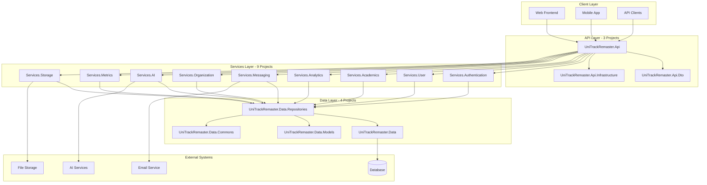
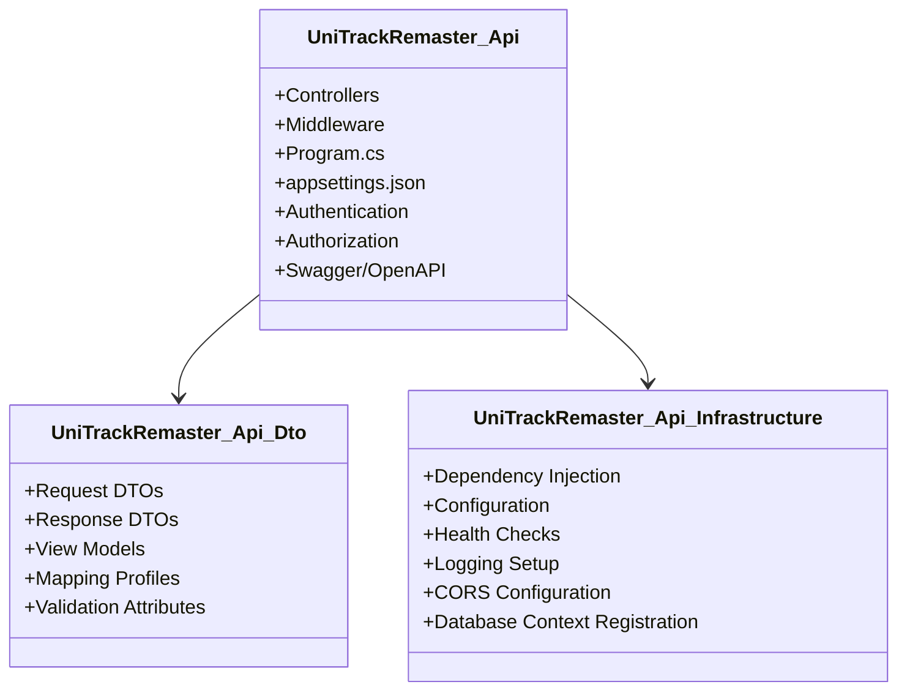
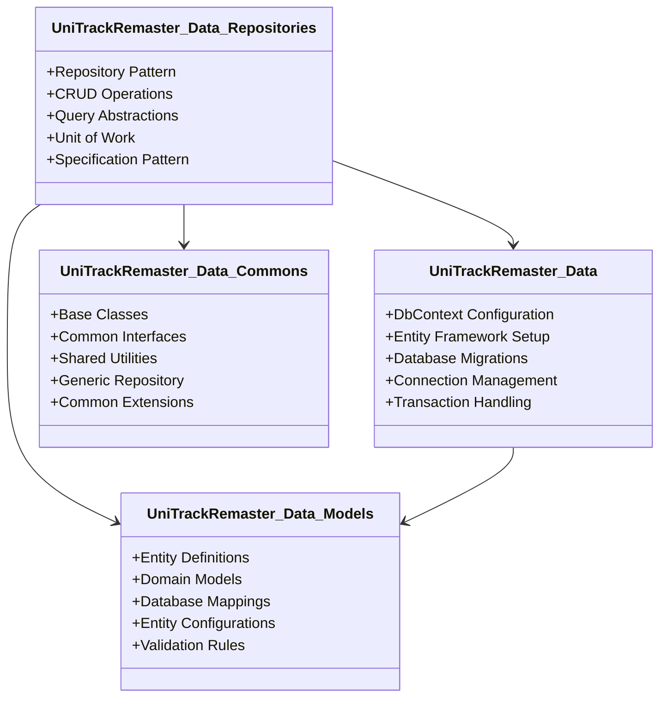
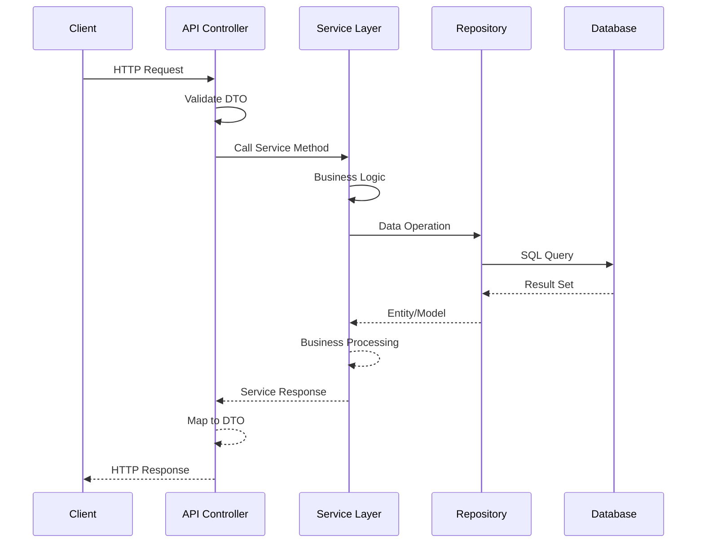
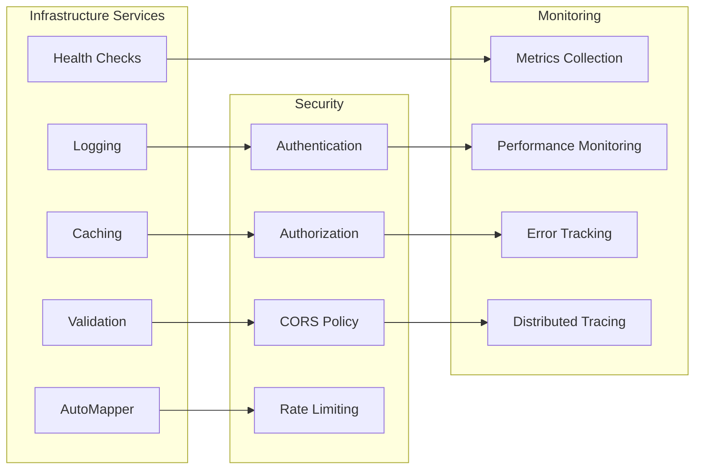

```mermaid
classDiagram
    class Services_Authentication {
        +Login/Logout
        +JWT Token Management
        +Password Reset
        +Two-Factor Auth
        +Session Management
    }

    class Services_User {
        +User Management
        +Profile Operations
        +Role Assignment
        +User Preferences
    }

    class Services_Academics {
        +Grade Management
        +Subject Operations
        +Semester Handling
        +Academic Year Logic
        +Enrollment Processing
    }

    class Services_Analytics {
        +Performance Analytics
        +Report Generation
        +Data Aggregation
        +Statistical Analysis
        +Trend Calculations
    }

    class Services_Messaging {
        +Chat System
        +Notifications
        +Email Integration
        +Message Threading
        +Real-time Updates
    }

    class Services_Organization {
        +Institution Management
        +Department Operations
        +Faculty Handling
        +Organizational Structure
    }

    class Services_AI {
        +AI-Powered Insights
        +Predictive Analytics
        +Recommendation Engine
        +Natural Language Processing
        +Machine Learning Models
    }

    class Services_Metrics {
        +Performance Tracking
        +System Metrics
        +User Activity Analytics
        +Application Monitoring
    }

    class Services_Storage {
        +File Upload/Download
        +Document Management
        +Image Processing
        +Storage Optimization
    }
```

```mermaid
classDiagram
    class Services_Authentication {
        +Login/Logout
        +JWT Token Management
        +Password Reset
        +Two-Factor Auth
        +Session Management
    }

    class Services_User {
        +User Management
        +Profile Operations
        +Role Assignment
        +User Preferences
    }

    class Services_Academics {
        +Grade Management
        +Subject Operations
        +Semester Handling
        +Academic Year Logic
        +Enrollment Processing
    }

    class Services_Analytics {
        +Performance Analytics
        +Report Generation
        +Data Aggregation
        +Statistical Analysis
        +Trend Calculations
    }

    class Services_Messaging {
        +Chat System
        +Notifications
        +Email Integration
        +Message Threading
        +Real-time Updates
    }

    class Services_Organization {
        +Institution Management
        +Department Operations
        +Faculty Handling
        +Organizational Structure
    }

    class Services_AI {
        +AI-Powered Insights
        +Predictive Analytics
        +Recommendation Engine
        +Natural Language Processing
        +Machine Learning Models
    }

    class Services_Metrics {
        +Performance Tracking
        +System Metrics
        +User Activity Analytics
        +Application Monitoring
    }

    class Services_Storage {
        +File Upload/Download
        +Document Management
        +Image Processing
        +Storage Optimization
    }
```

# UniTrackRemaster - Backend Architecture Layout

## **System Architecture Overview** 🏗️

---

## **Detailed Layer Breakdown** 📦

### **🌐 API Layer (3 Projects)**

**Responsibilities:**

- HTTP request/response handling
- API endpoint definitions
- Data transfer object contracts
- Infrastructure configuration and DI setup

---

### **⚙️ Services Layer (9 Projects)**

**Key Features:**

- **Domain-Driven Design** - Each service handles a specific business domain
- **Separation of Concerns** - Clear boundaries between different functionalities
- **Business Logic Encapsulation** - Core business rules and processes
- **Service Dependencies** - Services can depend on repositories and other services

---

### **💾 Data Layer (4 Projects)**

**Architecture Benefits:**

- **Repository Pattern** - Abstraction over data access logic
- **Entity Framework Core** - ORM for database operations
- **Clean Separation** - Models, repositories, and context are separated
- **Reusable Components** - Common base classes and interfaces

---

## **🔄 Data Flow Architecture**

---

## **🔧 Cross-Cutting Concerns**

---

## **📋 Project Dependencies Summary**

| Layer        | Project Count   | Primary Responsibility                    |
| ------------ | --------------- | ----------------------------------------- |
| **API**      | 3               | HTTP handling, DTOs, Infrastructure setup |
| **Services** | 9               | Business logic, domain operations         |
| **Data**     | 4               | Data access, entity management            |
| **Total**    | **16 Projects** | Complete backend system                   |

**Architecture Pattern:** Clean Architecture / Layered Architecture
**Key Benefits:**

- ✅ Separation of Concerns
- ✅ Testability
- ✅ Maintainability
- ✅ Scalability
- ✅ Domain-Driven Design# UniTrackRemaster - Backend Architecture Layout

## **System Architecture Overview** 🏗️

---

## **Detailed Layer Breakdown** 📦

### **🌐 API Layer (3 Projects)**

**Responsibilities:**

- HTTP request/response handling
- API endpoint definitions
- Data transfer object contracts
- Infrastructure configuration and DI setup

---

### **⚙️ Services Layer (9 Projects)**

**Key Features:**

- **Domain-Driven Design** - Each service handles a specific business domain
- **Separation of Concerns** - Clear boundaries between different functionalities
- **Business Logic Encapsulation** - Core business rules and processes
- **Service Dependencies** - Services can depend on repositories and other services

---

### **💾 Data Layer (4 Projects)**

**Architecture Benefits:**

- **Repository Pattern** - Abstraction over data access logic
- **Entity Framework Core** - ORM for database operations
- **Clean Separation** - Models, repositories, and context are separated
- **Reusable Components** - Common base classes and interfaces

---

## **🔄 Data Flow Architecture**

---

## **🔧 Cross-Cutting Concerns**

---

## **📋 Project Dependencies Summary**

| Layer        | Project Count   | Primary Responsibility                    |
| ------------ | --------------- | ----------------------------------------- |
| **API**      | 3               | HTTP handling, DTOs, Infrastructure setup |
| **Services** | 9               | Business logic, domain operations         |
| **Data**     | 4               | Data access, entity management            |
| **Total**    | **16 Projects** | Complete backend system                   |

**Architecture Pattern:** Clean Architecture / Layered Architecture
**Key Benefits:**

- ✅ Separation of Concerns
- ✅ Testability
- ✅ Maintainability
- ✅ Scalability
- ✅ Domain-Driven Design
