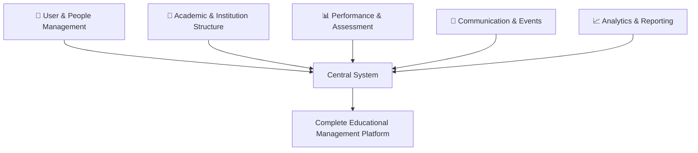
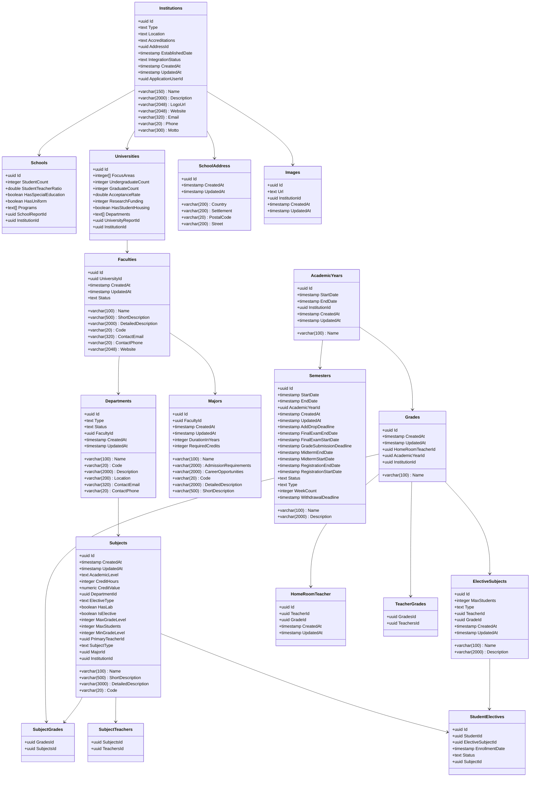
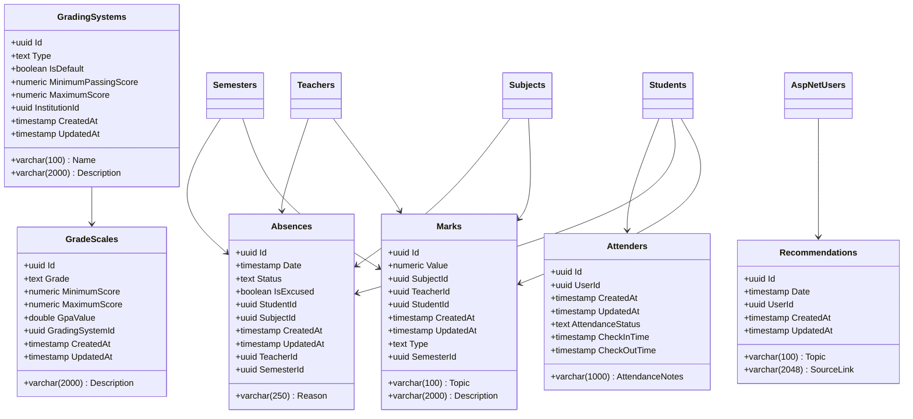
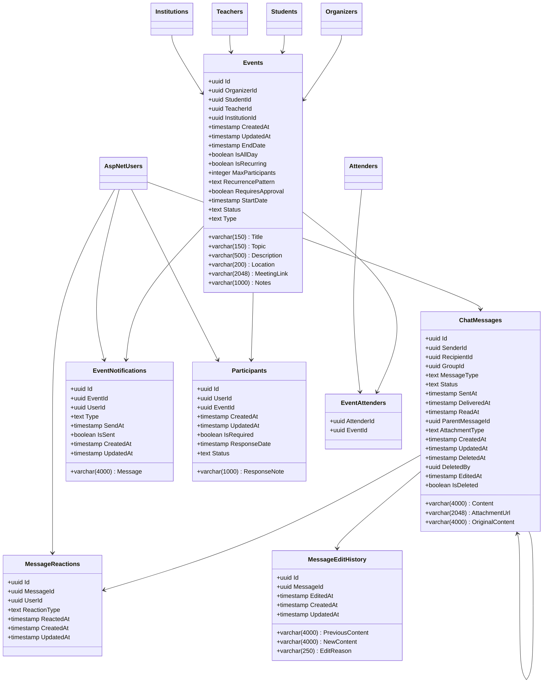
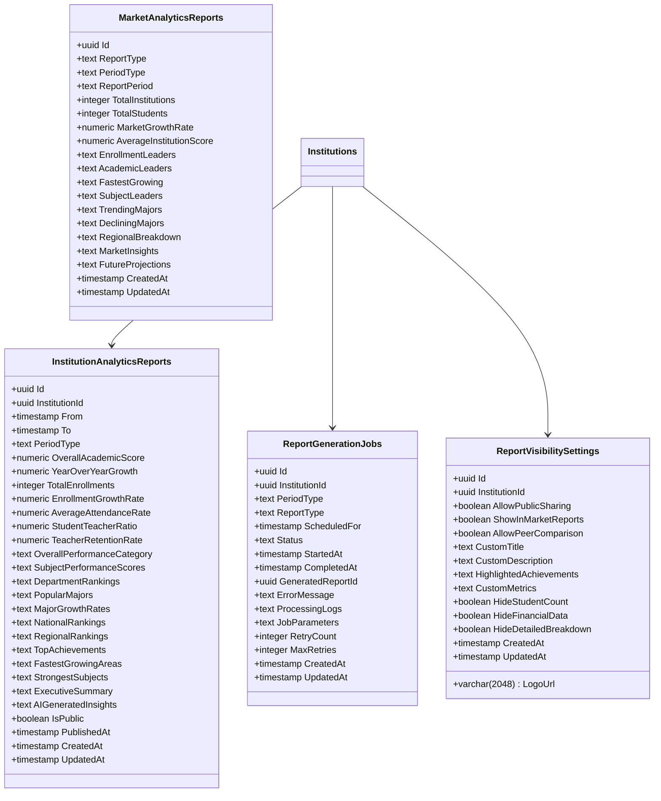

# Educational Management System - Database Schema Breakdown

## **Level 1: High-Level Group Overview** 📋

The system consists of 5 main functional areas that work together to manage educational institutions:

---

## **Level 2: Simplified Entity Overview** 🔗

---

## **1. 👥 User & People Management**

_"Who uses the system"_

**Core Entities:** 16 tables
**Purpose:** Manages all user types, authentication, and relationships

```mermaid
classDiagram
    class AspNetUsers {
        +uuid Id
        +varchar(50) FirstName
        +varchar(50) LastName
        +varchar(2000) RefreshToken
        +varchar(2048) AvatarUrl
        +timestamp RefreshTokenValidity
        +varchar(256) UserName
        +varchar(256) NormalizedUserName
        +varchar(256) Email
        +varchar(256) NormalizedEmail
        +boolean EmailConfirmed
        +text PasswordHash
        +text SecurityStamp
        +text ConcurrencyStamp
        +text PhoneNumber
        +boolean PhoneNumberConfirmed
        +boolean TwoFactorEnabled
        +timestamp LockoutEnd
        +boolean LockoutEnabled
        +integer AccessFailedCount
        +boolean IsLinked
        +boolean DataAnalytics
        +boolean EmailUpdates
        +boolean MarketingEmails
        +text ProfileVisibility
    }

    class Students {
        +uuid Id
        +boolean IsSchoolStudent
        +uuid UserId
        +uuid SchoolId
        +uuid UniversityId
        +uuid GradeId
        +uuid PersonalReportId
        +timestamp CreatedAt
        +timestamp UpdatedAt
        +uuid MajorId
        +uuid InstitutionId
        +text Status
    }

    class Teachers {
        +uuid Id
        +varchar(100) Title
        +uuid UserId
        +uuid ClassGradeId
        +uuid InstitutionId
        +timestamp CreatedAt
        +timestamp UpdatedAt
        +uuid DepartmentId
        +text Status
    }

    class Parents {
        +uuid Id
        +uuid UserId
        +timestamp CreatedAt
        +timestamp UpdatedAt
        +varchar(20) EmergencyContact
        +uuid InstitutionId
        +varchar(1000) Notes
        +varchar(100) Occupation
        +text Status
    }

    class Admins {
        +uuid Id
        +uuid UserId
        +timestamp CreatedAt
        +timestamp UpdatedAt
        +varchar(100) Department
        +uuid InstitutionId
        +varchar(1000) Notes
        +varchar(100) Position
        +text Role
        +timestamp StartDate
        +text Status
    }

    class SuperAdmins {
        +uuid Id
        +uuid UserId
        +timestamp CreatedAt
        +timestamp UpdatedAt
    }

    class Applications {
        +uuid Id
        +varchar(50) FirstName
        +varchar(50) LastName
        +varchar(320) Email
        +varchar(20) Phone
        +uuid InstitutionId
        +timestamp CreatedAt
        +timestamp UpdatedAt
        +varchar(20) Code
        +text Status
    }

    class AspNetRoles {
        +uuid Id
        +varchar(256) Name
        +varchar(256) NormalizedName
        +text ConcurrencyStamp
    }

    class AspNetUserRoles {
        +uuid UserId
        +uuid RoleId
    }

    class AspNetUserClaims {
        +integer Id
        +uuid UserId
        +text ClaimType
        +text ClaimValue
    }

    class AspNetUserLogins {
        +text LoginProvider
        +text ProviderKey
        +text ProviderDisplayName
        +uuid UserId
    }

    class AspNetUserTokens {
        +uuid UserId
        +text LoginProvider
        +varchar(100) Name
        +text Value
    }

    class AspNetRoleClaims {
        +integer Id
        +uuid RoleId
        +text ClaimType
        +text ClaimValue
    }

    class ParentStudent {
        +uuid StudentId
        +uuid ParentId
    }

    class Organizers {
        +uuid Id
        +uuid UserId
        +timestamp CreatedAt
        +timestamp UpdatedAt
        +boolean CanCreatePublicEvents
        +varchar(100) Department
        +uuid InstitutionId
        +varchar(100) Role
    }

    class Attenders {
        +uuid Id
        +uuid UserId
        +timestamp CreatedAt
        +timestamp UpdatedAt
        +varchar(1000) AttendanceNotes
        +text AttendanceStatus
        +timestamp CheckInTime
        +timestamp CheckOutTime
    }

    AspNetUsers --> Students
    AspNetUsers --> Teachers
    AspNetUsers --> Parents
    AspNetUsers --> Admins
    AspNetUsers --> SuperAdmins
    AspNetUsers --> Organizers
    AspNetUsers --> Attenders
    AspNetUsers --> AspNetUserRoles
    AspNetUsers --> AspNetUserClaims
    AspNetUsers --> AspNetUserLogins
    AspNetUsers --> AspNetUserTokens
    AspNetRoles --> AspNetUserRoles
    AspNetRoles --> AspNetRoleClaims
    Students --> ParentStudent
    Parents --> ParentStudent
```

**Key Features:**

- Identity management with ASP.NET Core Identity
- Role-based access control
- Multi-institutional support
- Parent-student relationships
- Application workflow for new users

---

## **2. 🏫 Academic & Institution Structure**

_"The educational framework"_

**Core Entities:** 18 tables
**Purpose:** Defines the academic hierarchy and course structure

**Key Features:**

- Multi-institutional support (Schools & Universities)
- Hierarchical academic structure
- Flexible semester/year management
- Subject and major organization
- Grade level management

---

## **3. 📊 Performance & Assessment**

_"Day-to-day academic tracking"_

**Core Entities:** 6 tables
**Purpose:** Tracks student performance, attendance, and grading

**Key Features:**

- Flexible marking system with topic-based grades
- Comprehensive absence tracking
- Configurable grading systems and scales
- Real-time attendance monitoring
- Multi-semester performance tracking

---

## **4. 💬 Communication & Events**

_"Interaction and scheduling"_

**Core Entities:** 7 tables
**Purpose:** Facilitates communication and event management

**Key Features:**

- Comprehensive event management system
- Real-time messaging with reactions
- Automated notification system
- Event participation tracking
- Role-based event creation

---

## **5. 📈 Analytics & Reporting**

_"Insights and data analysis"_

**Core Entities:** 4 tables
**Purpose:** Generates insights and performance reports

**Key Features:**

- Automated report generation
- AI-powered insights
- Market-wide analytics
- Customizable visibility settings
- Scheduled reporting system

---

## **Summary**

This educational management system provides a comprehensive platform covering:

- **User Management**: 16 tables managing authentication and user roles
- **Academic Structure**: 18 tables defining institutional hierarchy
- **Performance Tracking**: 6 tables for grades and attendance
- **Communication**: 7 tables for messaging and events
- **Analytics**: 4 tables for reporting and insights

**Total: 51 database tables** working together to create a complete educational ecosystem.
