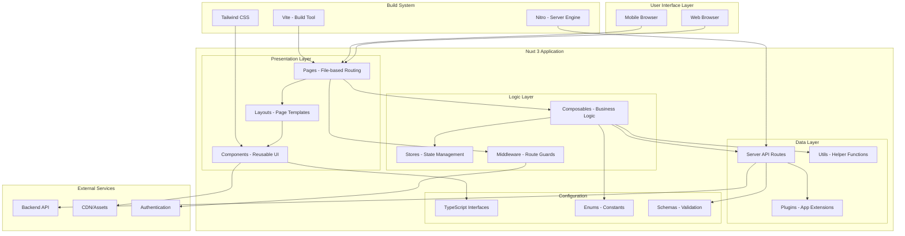
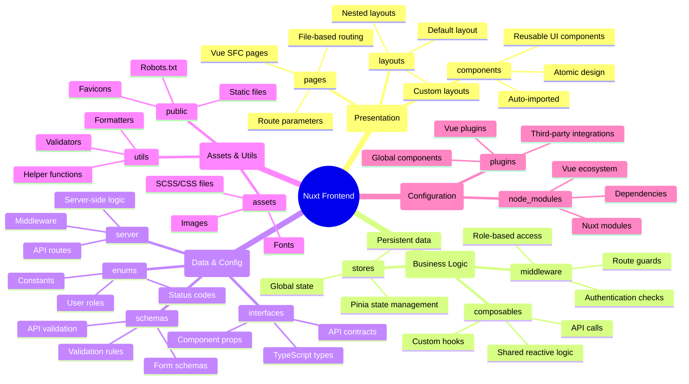
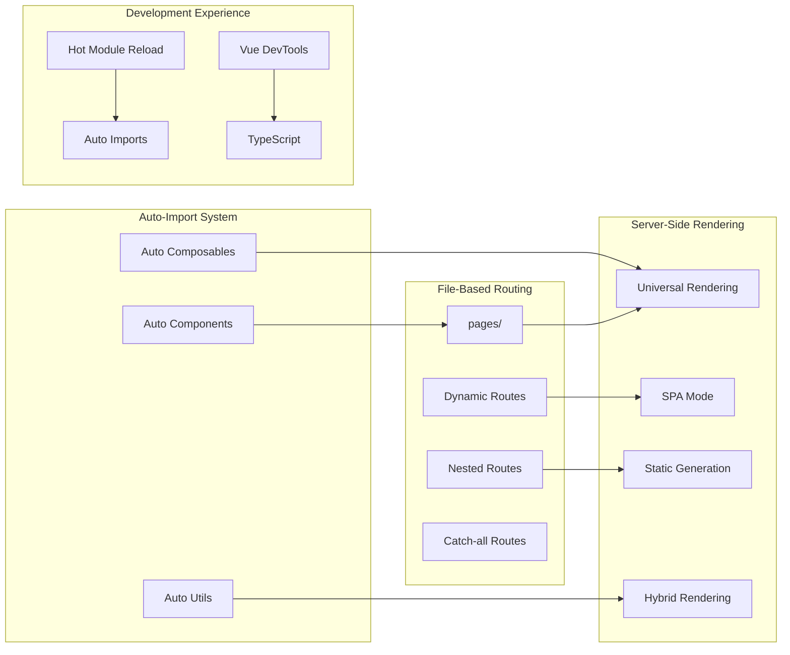
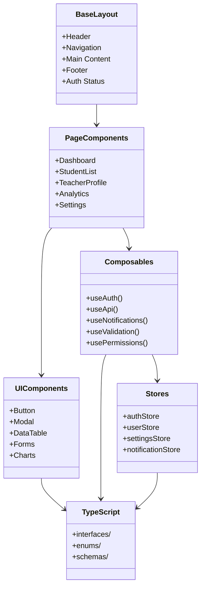
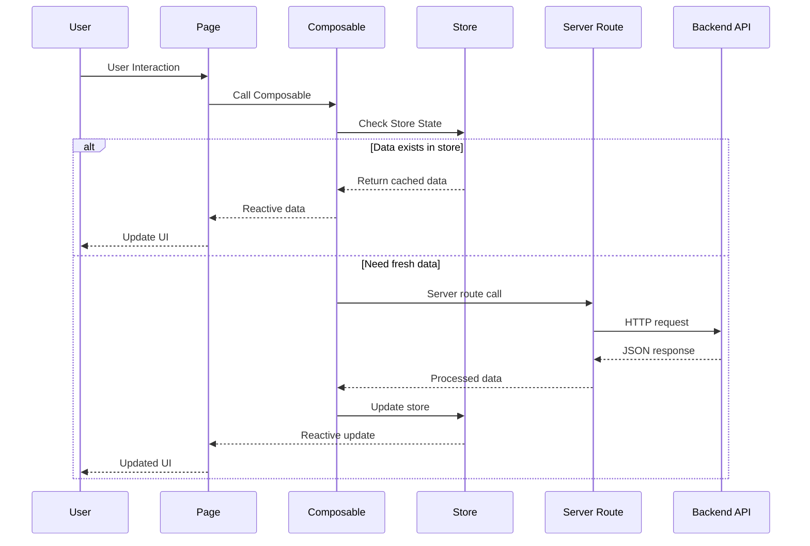
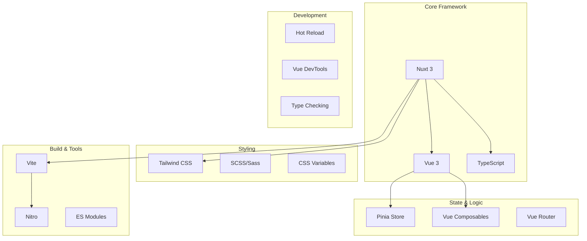
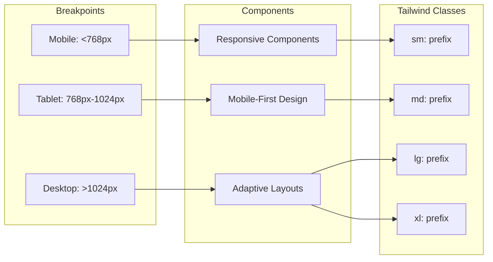

# UniTrackRemaster - Nuxt Frontend Architecture

## **🎯 Frontend Architecture Overview**

---

## **📁 Folder Structure & Responsibilities**

---

## **🔄 Nuxt 3 Architecture Patterns**

**Key Nuxt 3 Features Utilized:**

- 🚀 **Auto-imports** - Components, composables, and utils
- 📁 **File-based routing** - Automatic route generation
- 🔄 **Universal rendering** - SSR/SPA/Static hybrid
- 🎯 **Server API routes** - Full-stack in one project
- 📦 **Module ecosystem** - Tailwind, Pinia, etc.

---

## **🏗️ Component Architecture**

---

## **📊 Data Flow Architecture**

---

## **🛠️ Development Stack**

---

## **🔧 Configuration & Setup**

| File                 | Purpose      | Key Features                          |
| -------------------- | ------------ | ------------------------------------- |
| `nuxt.config.ts`     | Main config  | Modules, build settings, auto-imports |
| `tailwind.config.js` | Styling      | Custom theme, responsive design       |
| `tsconfig.json`      | TypeScript   | Strict typing, path mapping           |
| `package.json`       | Dependencies | Scripts, dev dependencies             |
| `.env`               | Environment  | API URLs, secrets                     |

---

## **📱 Responsive Design Strategy**

