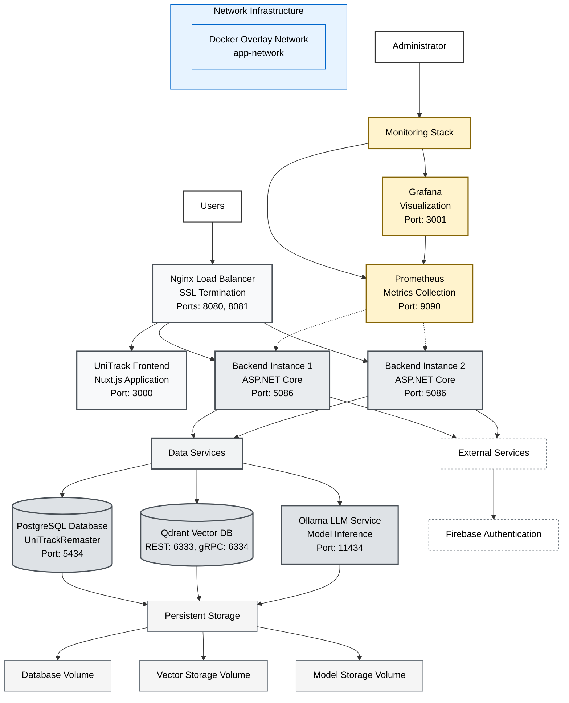

# UniTrack Production Architecture

## Overview

This document outlines the production architecture for the UniTrack application, a modern web application with integrated AI capabilities built using microservices architecture and containerized deployment.

## Architecture Diagram

## Architecture Layers

### 1. User Layer

**Components:** Users, Administrator

The entry point for all system interactions. Regular users access the application through the web interface, while administrators have additional access to monitoring and observability tools.

**Access Patterns:**

- Users connect via HTTPS on port 8080
- Administrators access monitoring tools directly on dedicated ports

### 2. Presentation Layer

**Components:** Nginx Load Balancer, UniTrack Frontend

This layer handles all user-facing interactions and traffic distribution.

**Nginx Load Balancer:**

- Provides SSL termination for secure connections
- Routes traffic between frontend and backend services
- Handles load balancing across multiple backend instances
- Serves as the single entry point for external traffic

**UniTrack Frontend:**

- Nuxt.js application providing the user interface
- Runs on port 3000 internally
- Communicates with backend services via `/api` routes

### 3. Application Layer

**Components:** Backend Instance 1, Backend Instance 2

The core business logic layer implemented as scalable ASP.NET Core services.

**Features:**

- **High Availability:** Two instances provide redundancy and load distribution
- **Stateless Design:** Enables horizontal scaling
- **API Gateway:** Centralizes business logic and data access
- **Authentication Integration:** Connects with Firebase for user management

**Scalability:**

- Configured with 2 replicas for production workloads
- Can be scaled horizontally based on demand
- Load balanced automatically by Nginx

### 4. Service Layer

**Components:** Data Services, External Services

Abstraction layer that groups related services and manages service dependencies.

**Data Services:**

- Centralizes access to all data storage systems
- Provides unified interface for backend applications
- Manages connections to relational, vector, and AI services

**External Services:**

- Handles integration with third-party services
- Currently includes Firebase authentication
- Designed for future external service integrations

### 5. Data Layer

**Components:** PostgreSQL Database, Qdrant Vector Database, Ollama LLM Service

The persistence and AI processing layer.

**PostgreSQL Database:**

- Primary relational database for application data
- Stores user information, application state, and transactional data
- Configured with health checks and automatic restart policies

**Qdrant Vector Database:**

- Specialized vector database for AI/ML operations
- Supports both REST (6333) and gRPC (6334) APIs
- Handles vector similarity search and embeddings storage

**Ollama LLM Service:**

- Local large language model inference service
- Provides AI capabilities without external dependencies
- Runs on port 11434 with persistent model storage

### 6. Monitoring Layer

**Components:** Prometheus, Grafana

Comprehensive observability and monitoring infrastructure.

**Prometheus:**

- Metrics collection and storage
- Scrapes metrics from all application services
- Provides alerting capabilities
- Time-series database for performance monitoring

**Grafana:**

- Visualization and dashboarding platform
- Connects to Prometheus for data queries
- Provides real-time monitoring dashboards
- Administrative interface on port 3001

### 7. Storage Layer

**Components:** Database Volume, Vector Storage Volume, Model Storage Volume

Persistent storage management for all stateful services.

**Storage Volumes:**

- **Database Volume:** PostgreSQL data persistence
- **Vector Storage Volume:** Qdrant vector data and indices
- **Model Storage Volume:** Ollama language models and configurations

**Benefits:**

- Data persistence across container restarts
- Backup and recovery capabilities
- Performance optimization through dedicated storage

### 8. Network Infrastructure

**Components:** Docker Overlay Network

Container networking and service discovery.

**Docker Overlay Network (app-network):**

- Enables secure inter-service communication
- Provides service discovery and DNS resolution
- Isolates application traffic from external networks
- Supports multi-host deployment scenarios

## Deployment Characteristics

### High Availability

- Multiple backend instances with load balancing
- Health checks for critical services
- Automatic restart policies for service recovery

### Security

- SSL termination at the load balancer
- Network isolation through overlay networks
- Secure internal service communication
- External authentication via Firebase

### Scalability

- Horizontal scaling of backend services
- Stateless application design
- Resource limits and reservations for optimal performance

### Observability

- Comprehensive metrics collection
- Real-time monitoring and alerting
- Performance dashboards and analytics

## Technology Stack

| Layer          | Technology           | Purpose                                 |
| -------------- | -------------------- | --------------------------------------- |
| Frontend       | Nuxt.js              | Server-side rendered Vue.js application |
| Backend        | ASP.NET Core         | RESTful API and business logic          |
| Database       | PostgreSQL           | Relational data storage                 |
| Vector DB      | Qdrant               | Vector similarity search                |
| AI/ML          | Ollama               | Local language model inference          |
| Load Balancer  | Nginx                | Traffic routing and SSL termination     |
| Monitoring     | Prometheus + Grafana | Metrics and visualization               |
| Authentication | Firebase             | User management and authentication      |
| Orchestration  | Docker Compose       | Container orchestration                 |

## Performance Considerations

- **Backend Scaling:** Configured with 2 replicas, can be increased based on load
- **Resource Limits:** AI services have memory constraints (Ollama: 8GB, Qdrant: 2GB)
- **Storage Optimization:** Dedicated volumes for each data service
- **Network Efficiency:** Overlay network for optimized inter-service communication

This architecture provides a robust, scalable, and maintainable foundation for the UniTrack application with integrated AI capabilities.
