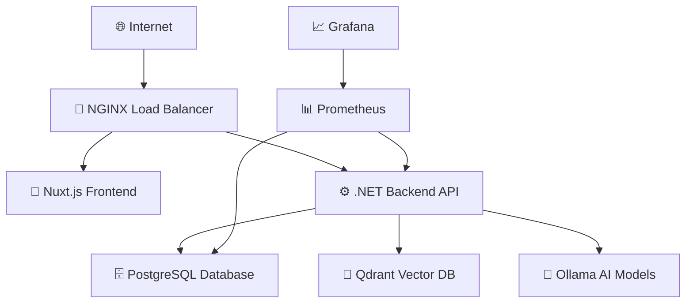

# 🚀 UniTrack Complete Setup Guide

> **A step-by-step guide to deploy UniTrack's full-stack educational management platform**

## 📋 Prerequisites

Before starting, ensure you have:

- **Docker & Docker Compose** (v20.10+)
- **Git** for cloning the repository
- **A domain** (for production) or localhost for development
- **SSL certificates** (for HTTPS in production)

## 🏗️ Architecture Overview

UniTrack consists of 8 interconnected services:



### Service Breakdown

| Service        | Purpose                         | Ports                     | Resources    |
| -------------- | ------------------------------- | ------------------------- | ------------ |
| **NGINX**      | Load balancer & reverse proxy   | 8080 (HTTPS), 8081 (HTTP) | Lightweight  |
| **Frontend**   | Nuxt.js Progressive Web App     | 3000                      | 512MB RAM    |
| **Backend**    | .NET Core API (2 replicas)      | 5086                      | 1GB RAM each |
| **PostgreSQL** | Main relational database        | 5434                      | 2GB RAM      |
| **Qdrant**     | Vector database for AI features | 6333 (HTTP), 6334 (gRPC)  | 2GB RAM      |
| **Ollama**     | Local AI model hosting          | 11434                     | 8GB RAM      |
| **Prometheus** | Metrics collection              | 9090                      | 512MB RAM    |
| **Grafana**    | Monitoring dashboards           | 3001                      | 512MB RAM    |

---

## 🗂️ Configuration Files Structure

Your project should be organized as follows:

```
UniTrackRemaster/
├── docker-compose.yml                    # 🐳 Main orchestration
├── nginx.conf                           # 🔄 Load balancer config
├── prometheus.yml                       # 📊 Metrics config
├── .env                                 # 🔐 Environment variables
├── ssl/                                 # 🔒 SSL certificates
│   ├── cert.pem
│   └── key.pem
├── UniTrackRemasterBackend/
│   ├── Dockerfile
│   ├── appsettings.json                 # ⚙️ API configuration
│   ├── appsettings.Production.json      # 🏭 Production overrides
│   └── unitrack-firebase-credentials.json
└── UniTrackRemasterFrontend/
    ├── Dockerfile
    ├── nuxt.config.ts                   # 🎨 Frontend configuration
    └── .env
```

---

## 🚀 Quick Start

### 1. Clone & Setup

```bash
git clone https://github.com/SpasMilenkov/UniTrackRemaster.git
cd UniTrackRemaster

# Copy environment template
cp .env.example .env
```

### 2. Configure Environment Variables

```bash
# Edit .env with your actual values
nano .env
```

### 3. Initialize Docker Swarm

```bash
# Initialize swarm mode
docker swarm init

# Deploy the stack
docker stack deploy -c docker-compose.yml unitrack
```

### 4. Verify Deployment

```bash
# Check service status
docker service ls

# View logs
docker service logs unitrack_unitrack-backend
```

### 5. Access Services

- **Main Application**: https://localhost:8080
- **API Documentation**: https://localhost:8080/api/swagger
- **Grafana Dashboard**: http://localhost:3001 (admin/admin)
- **Prometheus Metrics**: http://localhost:9090

---

## ⚙️ Configuration Sections

This setup guide is split into three detailed configuration sections:

### 📦 [1. Infrastructure & Docker Setup](./docker-setup.md)

- Docker Compose configuration
- Service networking and volumes
- SSL and security setup
- Container health checks

### 🔧 [2. Backend API Configuration](./backend-setup.md)

- .NET Core API settings
- Database connections
- JWT authentication
- External service integrations (Gmail, Firebase, AI)

### 🎨 [3. Frontend Configuration](./frontend-setup.md)

- Nuxt.js application setup
- PWA configuration
- API integration
- Multi-language support

---

## 🔐 Required API Keys & Credentials

You'll need to obtain the following before deployment:

### 🔑 Authentication & Security

- **JWT Secret Key** (generate a random 256-bit key)
- **Firebase Service Account** (for file storage)

### 📧 Email Services (Choose One)

- **Gmail OAuth2** (ClientId, ClientSecret, RefreshToken)
- **Mailtrap** (Host, Port, Username, Password) - for development

### 🤖 AI Services (Optional but Recommended)

- **Ollama Models** - Downloaded automatically on first run
- **Qdrant** - No API key needed for local deployment

### 📊 Monitoring (Pre-configured)

- **Prometheus** - No configuration needed
- **Grafana** - Default admin/admin credentials

---

## 🛠️ Development vs Production

### Development Mode

```bash
# Use development compose file
docker-compose -f docker-compose.dev.yml up -d

# Enable hot reloading
npm run dev  # For frontend
dotnet watch  # For backend
```

### Production Mode

```bash
# Production deployment with SSL
docker stack deploy -c docker-compose.yml unitrack

# Check production logs
docker service logs -f unitrack_unitrack-backend
```

---

## 🐛 Common Issues & Troubleshooting

### Services Not Starting

```bash
# Check service status
docker service ps unitrack_unitrack-backend --no-trunc

# View detailed logs
docker service logs unitrack_unitrack-backend
```

### Database Connection Issues

```bash
# Test database connectivity
docker exec -it unitrack_unitrack-db_1 psql -U postgres -d UniTrackRemaster

# Check connection string in logs
docker service logs unitrack_unitrack-backend | grep -i "connection"
```

### AI Services Not Responding

```bash
# Check Ollama status
curl http://localhost:11434/api/version

# Check Qdrant status
curl http://localhost:6333/health
```

### SSL Certificate Issues

```bash
# Generate self-signed certificates for testing
openssl req -x509 -nodes -days 365 -newkey rsa:2048 \
  -keyout ssl/key.pem -out ssl/cert.pem
```

---

## 📚 Next Steps

1. **[Configure Docker Infrastructure](./docker-setup.md)** - Set up the container orchestration
2. **[Configure Backend API](./backend-setup.md)** - Set up the .NET Core API with all integrations
3. **[Configure Frontend](./frontend-setup.md)** - Set up the Nuxt.js Progressive Web App

Once all three sections are complete, you'll have a fully functional UniTrack deployment! 🎉

---

## 🆘 Getting Help

- **📖 Documentation**: [spasmilenkov.github.io/UniTrackDocs](https://spasmilenkov.github.io/UniTrackDocs/)
- **🐛 Issues**: [GitHub Issues](https://github.com/SpasMilenkov/UniTrackRemaster/issues)
- **💬 Discussions**: [GitHub Discussions](https://github.com/SpasMilenkov/UniTrackRemaster/discussions)

_Continue to the next section: [Docker Infrastructure Setup](./docker-setup.md)_
