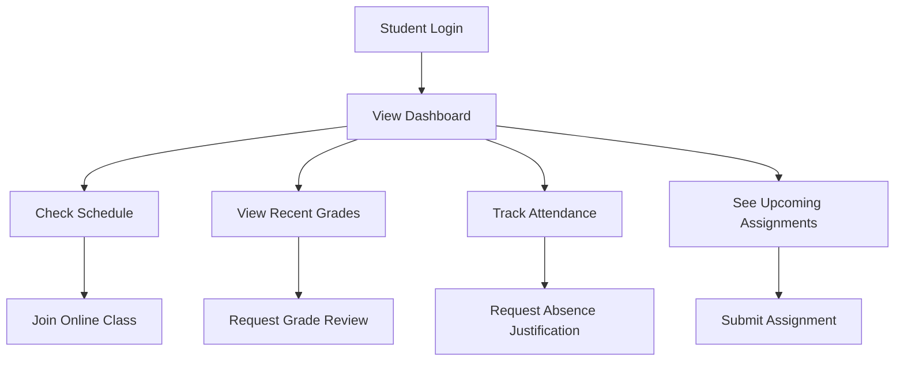

# 📊 Dashboard Module

The UniTrack Dashboard module serves as the central hub for all users, providing a personalized overview of the educational institution based on the user's role and permissions.

## 🌟 Key Features

### Role-Based Dashboards

The dashboard adapts to display relevant information based on user roles:

- **Student Dashboard**: Shows course schedule, upcoming assignments, recent grades, and attendance statistics
- **Teacher Dashboard**: Provides class lists, upcoming lessons, marking tasks, and student performance metrics
- **Administrator Dashboard**: Displays institution-wide analytics, user management tools, and system status

### Real-Time Analytics

The dashboard presents real-time data visualizations to help users make informed decisions:

- **Performance Metrics**: Grade distribution charts, attendance trends, and comparative analysis
- **Resource Utilization**: Classroom occupancy, faculty workload, and system usage statistics
- **Institutional KPIs**: Enrollment rates, academic performance, and student retention metrics

### Customizable Widgets

Users can personalize their dashboard experience:

- **Widget Library**: Choose from a variety of information displays and tools
- **Layout Customization**: Drag-and-drop interface for arranging widgets
- **Saved Configurations**: Multiple dashboard layouts for different tasks or focuses

## 💡 Use Cases

### For Students

### For Teachers

The dashboard helps teachers manage their daily responsibilities by providing:

- Quick access to class rosters and student profiles
- Tools for recording attendance and inputting grades
- Calendar view of teaching schedule and academic events
- Notification system for student submissions and academic issues

### For Administrators

Administrators benefit from comprehensive institutional oversight:

- Bird's-eye view of academic operations
- User management and permission controls
- System health monitoring and maintenance tools
- Institutional performance analytics and reporting features

## 🖥️ Technical Implementation

The Dashboard module is built using:

- **Vue.js** for responsive and interactive frontend components
- **Naive UI** for consistent design language and user experience
- **Chart.js** for data visualization
- **Pinia** for state management
- **Real-time data** via WebSocket connections for live updates

## 🔄 Integration Points

The Dashboard module integrates with other UniTrack components:

- **Academic Structure Module**: Pulls organizational hierarchy data
- **User Management System**: Retrieves role-based permissions and user details
- **Grading System**: Displays academic performance metrics
- **Attendance Tracking**: Shows presence statistics and trends
- **Calendar Module**: Highlights upcoming events and deadlines

## ⚙️ Configuration Options

Administrators can configure dashboard settings at both system and user levels:

| Setting            | Description                                        | Default              |
| ------------------ | -------------------------------------------------- | -------------------- |
| Default Widgets    | Define standard widgets for each user role         | Role-specific preset |
| Refresh Rate       | How often data is updated                          | 5 minutes            |
| Data Retention     | How long historical dashboard data is kept         | 1 academic year      |
| Widget Permissions | Control which widgets are available to which roles | Role-based access    |

## 🚀 Getting Started with the Dashboard

For users new to UniTrack, the dashboard offers:

1. **Guided Tour**: Interactive walkthrough of available features
2. **Quick Start Cards**: Shortcuts to common actions based on user role
3. **Notification Center**: Important alerts and system messages
4. **Search Functionality**: Fast access to people, courses, and resources

The Dashboard serves as both an information hub and a launchpad to other system features, streamlining the educational management experience for all stakeholders.
