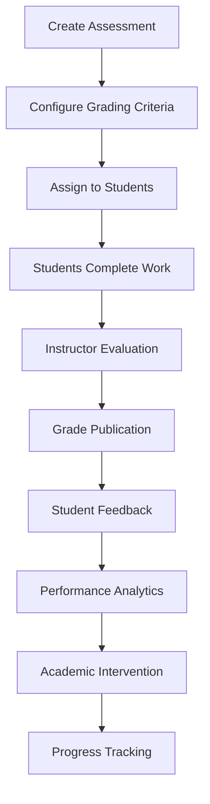

# 📝 Grading and Assessment Module

The Grading and Assessment module in UniTrack provides comprehensive tools for evaluating, recording, and analyzing student performance across all educational contexts.

## 🌟 Key Features

### Flexible Grading Systems

UniTrack supports multiple grading methodologies to accommodate diverse educational approaches:

- **Traditional letter grades**: A, B, C, D, F with optional +/- modifiers
- **Numerical scales**: 0-100, 1-10, 0-4, and custom ranges
- **GPA calculation**: Weighted and unweighted GPA with customizable scale
- **Standards-based grading**: Evaluate students against specific learning objectives
- **Competency-based assessment**: Track mastery of defined competencies
- **Custom grading schemes**: Create institution-specific evaluation systems

### Comprehensive Assessment Tools

The module offers a wide range of assessment capabilities:

- **Multiple assessment types**: Exams, quizzes, assignments, projects, presentations
- **Weighted categories**: Configure grade calculations with category weighting
- **Rubric builder**: Create detailed evaluation criteria for complex assessments
- **Outcome mapping**: Connect assessments to learning outcomes and objectives
- **Peer assessment**: Enable student-to-student evaluation with teacher oversight
- **Self-assessment**: Allow students to reflect on and evaluate their own work

### Advanced Analytics

Powerful analytics help stakeholders understand performance patterns:

- **Individual student dashboards**: Detailed view of personal performance
- **Class performance reports**: Statistical analysis of group achievement
- **Trend analysis**: Track progress over time with visual representations
- **Comparative analytics**: Benchmark performance against historical data
- **Predictive insights**: Early warning system for at-risk students
- **Learning gap identification**: Pinpoint areas needing additional instruction

## 💡 Use Cases

### Assessment Workflow

### Grading Policy Implementation

The system helps institutions implement their grading policies:

- **Curve adjustments**: Apply statistical normalization to raw scores
- **Late submission handling**: Automated penalties for overdue work
- **Grade forgiveness**: Implement policies for dropped lowest grades
- **Extra credit management**: Track and incorporate bonus points
- **Grade appeals**: Structured workflow for grade disputes and resolutions

### Transcript Generation

Comprehensive transcript tools provide:

- **Official transcript formatting**: Institution-branded grade reports
- **Cumulative record keeping**: Complete academic history
- **Degree progress tracking**: Credits toward graduation requirements
- **Term and cumulative GPA**: Automatically calculated statistics
- **Academic honors**: Recognition based on performance thresholds

## 🔧 Instructor Tools

### Grade Book Interface

Teachers benefit from an intuitive grade management interface:

- **Class overview**: At-a-glance view of student performance
- **Individual student view**: Detailed performance for specific students
- **Quick-entry grid**: Efficient batch grade entry
- **Mobile grading**: Grade submissions from any device
- **Comment bank**: Reusable feedback for common situations
- **Audio/video feedback**: Multimedia commenting on student work

### Assessment Creation

The system streamlines the creation of evaluations:

- **Assessment templates**: Reusable formats for common evaluation types
- **Question banks**: Create, categorize, and reuse assessment items
- **Auto-graded options**: Multiple choice, true/false, matching questions
- **Manual grading tools**: Rubrics and annotation for complex submissions
- **Plagiarism detection**: Integration with academic integrity tools
- **Accessibility checking**: Ensure assessments meet accessibility standards

## 📊 Student View

Students receive comprehensive insights into their academic performance:

- **Grade dashboard**: Visual representation of current standing
- **Assignment calendar**: Upcoming and past evaluation dates
- **Feedback portal**: Review instructor comments and suggestions
- **Progress tracking**: Monitor improvement over time
- **Goal setting**: Establish and track personal academic targets
- **What-if analysis**: Calculate potential grade outcomes based on future performance

## 🔄 Integration Points

The Grading module connects with:

- **Academic Structure**: Links assessments to courses and programs
- **Learning Management System**: Synchronizes with online course content
- **Student Information System**: Updates official academic records
- **Reporting Engine**: Provides data for institutional analytics
- **Parent Portal**: Shares appropriate performance data with families
- **API Integrations**: Connects with third-party educational tools

## ⚙️ Configuration Options

The module offers extensive customization options:

| Setting              | Description                                       | Default                  |
| -------------------- | ------------------------------------------------- | ------------------------ |
| Grading Scale        | Define grade ranges and corresponding letters/GPA | A: 90-100, B: 80-89...   |
| Category Weights     | Set importance of different assessment types      | Equal weighting          |
| Score Rounding       | Configure how decimal scores are rounded          | Round to nearest 0.1     |
| Grade Visibility     | Control when grades are visible to students       | After instructor release |
| Comment Requirements | Set minimum feedback requirements                 | Optional                 |
| Grade Change Logging | Track history of grade modifications              | Enabled                  |

## 📋 Reporting Capabilities

The system generates a variety of reports for different stakeholders:

### For Instructors

- Class performance summaries
- Individual student progress reports
- Assignment statistics and item analysis
- Grading completion status

### For Students and Parents

- Current grade standing
- Progress toward learning objectives
- Performance trends over time
- Comparative anonymized class statistics

### For Administrators

- Department and program-level performance
- Grade distribution analysis
- Instructor grading patterns
- Accreditation and compliance reports

## 🚀 Getting Started

To set up the Grading and Assessment system:

1. **Configure grading schemes**: Define the grading systems for your institution
2. **Set up grade categories**: Create weighted assessment types
3. **Establish grade periods**: Define terms, semesters, or quarters
4. **Import existing data**: Bring in historical grade information
5. **Train faculty**: Provide guidance on grade entry and assessment tools

The Grading and Assessment module provides the tools necessary to evaluate student learning fairly and consistently while offering powerful insights into academic performance.
