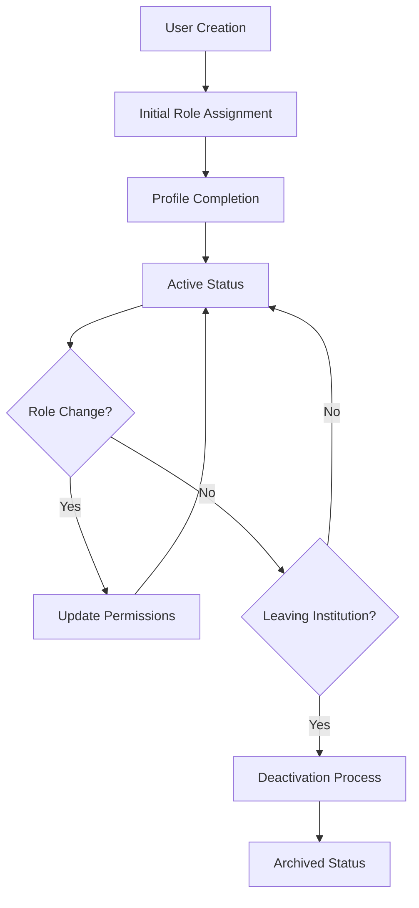

# 👥 User Management Module

The User Management module in UniTrack provides comprehensive tools for managing all stakeholders in the educational ecosystem, with role-based access controls and detailed user profiles.

## 🌟 Key Features

### Role-Based User System

UniTrack implements a sophisticated role system that caters to all participants in the educational process:

- **Students**: Learners enrolled in courses or programs
- **Teachers/Faculty**: Educators responsible for instruction and assessment
- **Administrators**: Staff who manage institutional operations
- **Parents/Guardians**: Family members with oversight of student progress
- **System Administrators**: Technical staff with platform management responsibilities

### Comprehensive User Profiles

Each user type has a specialized profile with relevant information:

#### Student Profiles

- Academic records and transcripts
- Enrollment history and current courses
- Attendance records and statistics
- Performance analytics and progress tracking
- Personal information and contact details

#### Teacher Profiles

- Teaching assignments and schedule
- Professional qualifications and specializations
- Department affiliations and administrative roles
- Performance evaluations and professional development
- Contact information and office hours

#### Administrator Profiles

- Departmental responsibilities and permissions
- Administrative history and role changes
- System access logs and activity records
- Specialized training and certifications

### Advanced Permission System

UniTrack features a granular permission system:

- **Role-based access control**: Base permissions on institutional roles
- **Custom permission groups**: Create specialized access profiles for unique roles
- **Hierarchical permissions**: Implement access based on organizational position
- **Time-limited access**: Grant temporary permissions for specific periods
- **Delegated administration**: Allow department heads to manage their staff's access

## 💡 Use Cases

### User Lifecycle Management

### Student Progression Tracking

The system automatically manages student status changes through their academic journey:

- Applicant → Admitted → Enrolled → Active
- Tracks academic standing (Good Standing, Probation, Suspension)
- Manages transitions between programs or departments
- Handles graduation processes and alumni status

### Faculty Management

Specialized tools help manage teaching staff:

- Contract and appointment tracking
- Teaching load calculation and balancing
- Department assignments and administrative duties
- Office hour scheduling and availability

## 🔧 Administration Tools

### User Management Dashboard

Administrators have access to powerful user management tools:

- **User Directory**: Searchable listing of all system users
- **Bulk Operations**: Mass updates for multiple user accounts
- **Import/Export**: Tools for batch user creation and data export
- **Audit Logs**: Complete history of account changes and access

### Self-Service Features

Users can manage certain aspects of their own accounts:

- **Profile Updates**: Maintain personal information and preferences
- **Password Management**: Self-service password reset and security options
- **Notification Settings**: Configure communication preferences
- **Privacy Controls**: Manage data sharing and visibility options

## 🔒 Security Features

The User Management module prioritizes security:

- **Multi-factor Authentication**: Additional security for sensitive roles
- **Single Sign-On (SSO)**: Integration with institutional identity providers
- **Password Policies**: Configurable requirements for password strength
- **Login Monitoring**: Detection of unusual access patterns
- **Session Management**: Controls for concurrent logins and session timeouts

## 📊 Analytics and Reporting

The module provides insights into system usage and user behavior:

- **User Activity Reports**: Track engagement and system utilization
- **Role Distribution Analysis**: Visualize organizational composition
- **Access Pattern Monitoring**: Identify usage trends and potential issues
- **Compliance Reporting**: Generate reports for regulatory requirements

## 🔄 Integration Points

The User Management module connects with:

- **Academic Structure**: Associates users with organizational units
- **Authentication System**: Provides secure access mechanisms
- **Notification System**: Delivers targeted communications
- **Audit System**: Records user activities for compliance
- **External Systems**: Synchronizes with HR, SIS, and directory services

## ⚙️ Configuration Options

The module offers extensive customization options:

| Setting           | Description                                  | Default         |
| ----------------- | -------------------------------------------- | --------------- |
| Password Policy   | Define password strength requirements        | Medium security |
| Account Lockout   | Set thresholds for failed login attempts     | 5 attempts      |
| Session Timeout   | Duration of inactivity before logout         | 30 minutes      |
| Profile Fields    | Customizable fields for different user types | Role-specific   |
| Auto-Provisioning | Rules for automatic account creation         | Disabled        |

## 🚀 Getting Started

To set up the User Management system:

1. **Define organizational roles**: Configure the roles that match your institution
2. **Create permission groups**: Establish access control groups
3. **Set up user templates**: Define standard profiles for each user type
4. **Configure authentication**: Set security policies and login methods
5. **Import initial users**: Add existing stakeholders to the system

The User Management module forms the foundation of UniTrack's security model, ensuring that each user has appropriate access to the tools and information they need.
